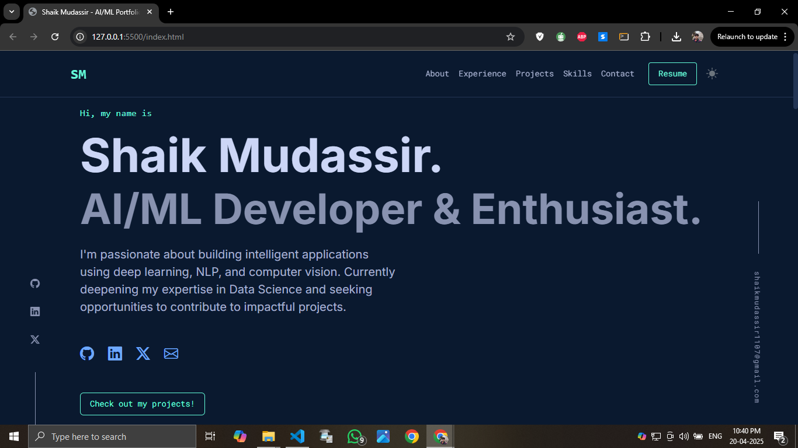

# 💼 Shaik Mudassir - AI/ML Portfolio Website

This is a personal portfolio website showcasing my work, experience, and skills as an aspiring AI/ML Developer. Built with HTML, CSS, JavaScript, and Bootstrap 5, it highlights projects, education, skills, and more in a responsive, visually appealing layout.

## 📸 Preview



## 🚀 Features

- 🌗 Light/Dark Theme Toggle with LocalStorage support
- 🧠 Animated Sections on Scroll using Intersection Observer
- 🛠️ Projects showcased with a responsive Bootstrap Carousel
- 🧾 Resume Download Button
- 📱 Fully Responsive Design
- 🧩 Organized Skills Section with Accordion UI
- 📬 Contact section with email link

## 🧰 Technologies Used

- HTML5, CSS3, JavaScript
- Bootstrap 5 & Bootstrap Icons
- Google Fonts (Inter, Roboto Mono)

## 📁 Folder Structure

```
📂 your-portfolio/
├── index.html
├── style.css
├── script.js
└── Shaik_Mudassir.pdf (Resume)
```

## 🔧 Setup

To run the project locally:

```bash
git clone https://github.com/your-username/your-portfolio.git
cd your-portfolio
# Open index.html in your browser
```

## 🌐 Live Demo

You can check the live version of this portfolio at:

**🔗 [https://shaikmudassir.tech](https://shaikmudassir.tech)**

## 📬 Contact

Feel free to reach out:

- 📧 [shaikmudassir1107@gmail.com](mailto:shaikmudassir1107@gmail.com)
- 💼 [LinkedIn](https://www.linkedin.com/in/shaik-mudassir-5b1107202/)
- 🐙 [GitHub](https://github.com/Shaik-Mudassir2001)

---

> Designed & Developed by Shaik Mudassir with ❤️
